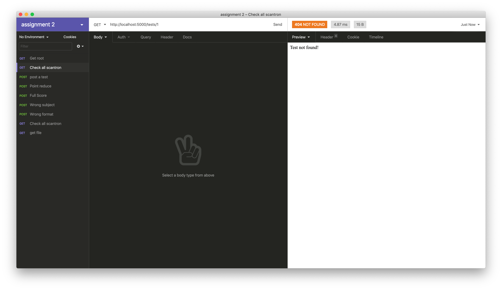
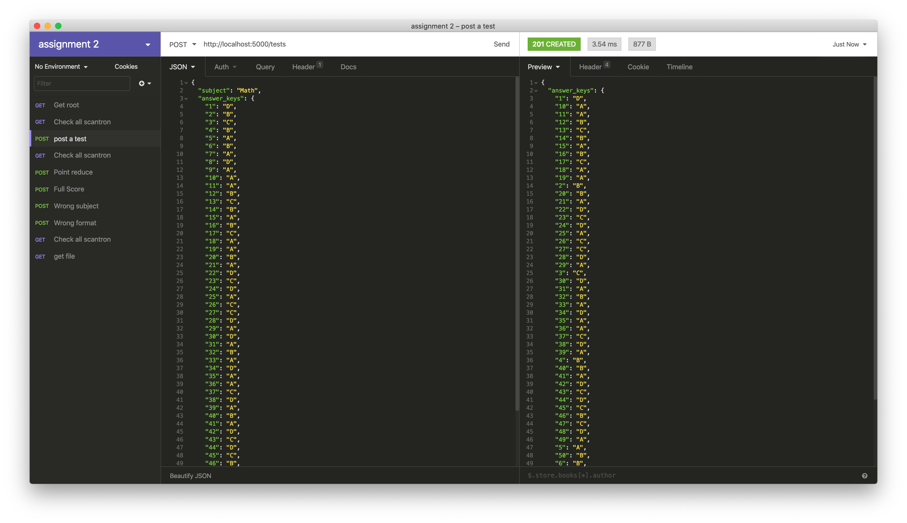
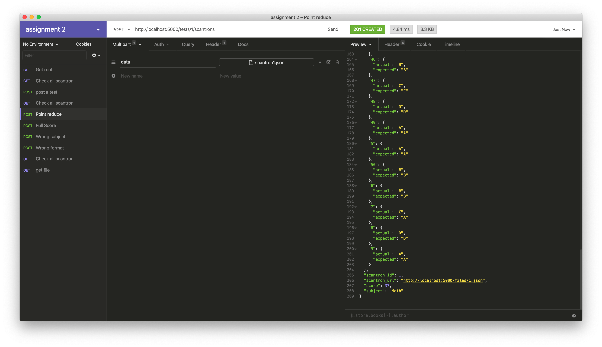
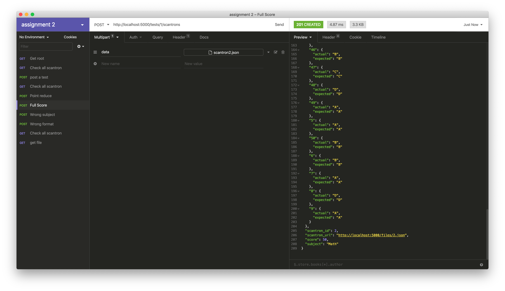
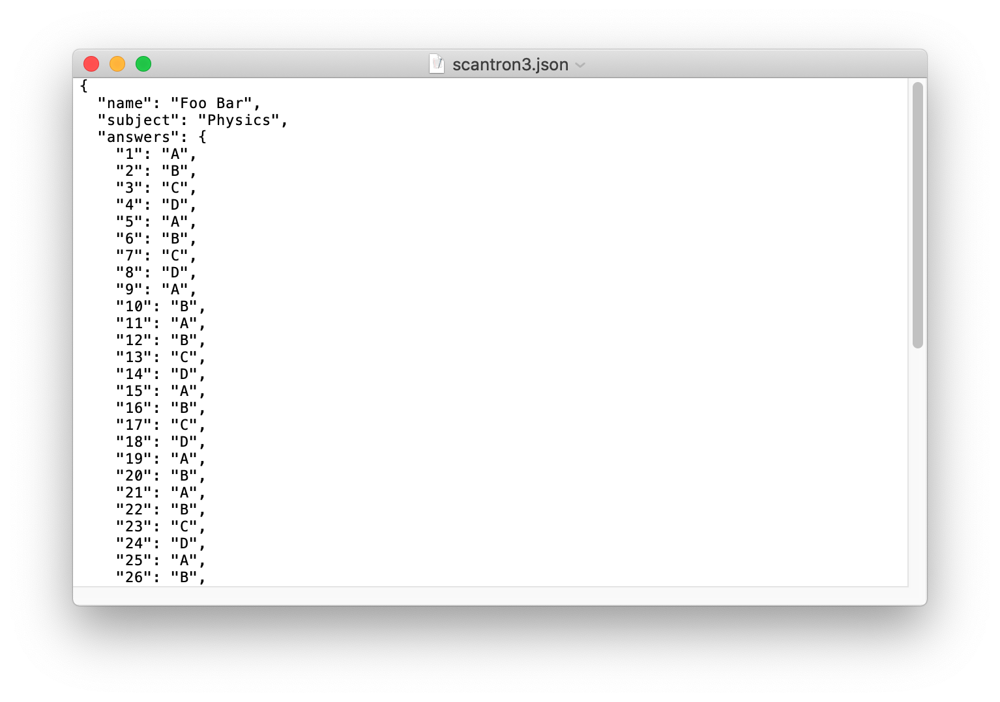
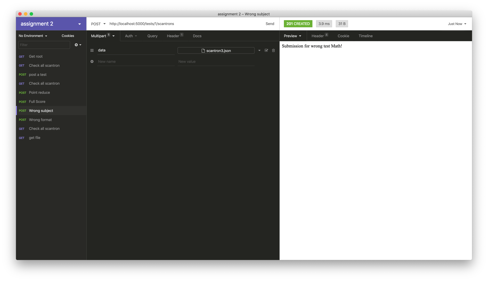
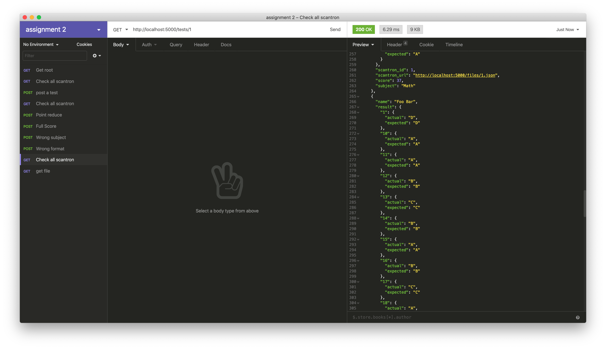

# cmpe273-assignment2

## Get Scantron Before Posting a Test

## Post a test "Math"

## Upload submissions

### With point reduction

### With full score

### With wrong subject "Physics"

### With wrong format at number 14

## Get all submissions

## Get an uploaded scantron

